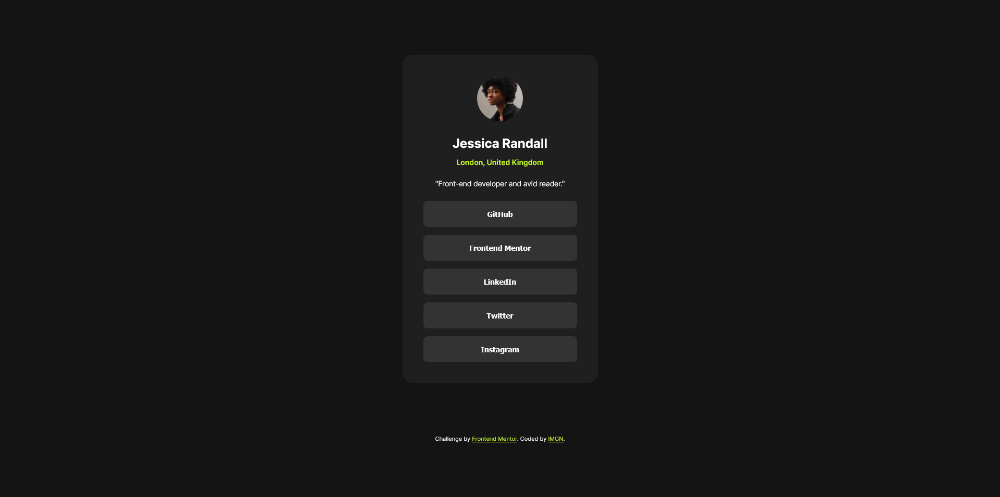

# Frontend Mentor – Blog Preview Card Solution

A simple, responsive blog‑preview card built to the [Frontend Mentor challenge](https://www.frontendmentor.io/challenges/blog-preview-card-ckPaj01IcS).

---

## Overview

- **Challenge:** Create a social link-sharing profile.  
- **Screenshot:**  
    
- **Live Site:** https://imaginebillie.github.io/Social-links-profile/
- **Solution Repo:** https://github.com/ImagineBillie/Social-links-profile.git

---

## My Process

**Built With**  
- Semantic HTML5  
- CSS Custom Properties  
- CSS Grid  

## Key Learnings

**Responsive Unit Mastery**  
   - Practical application of viewport units (`vh`/`vw`)  
   - Strategic use of `rem`/`em` for scalable layouts  
   - `dvh` adoption for mobile viewport handling  
   - Max-width constraints for content containment

---

## Great Resources
| Category              | Resource Link                                                                 |
|-----------------------|-------------------------------------------------------------------------------|
| Font Optimization     | [Google Fonts Best Practices](https://fonts.google.com/knowledge)             |
| Layout Systems        | [CSS Grid Complete Guide](https://css-tricks.com/snippets/css/complete-guide-grid/) |
| Flexbox Mastery       | [Flexbox Froggy Game](https://flexboxfroggy.com/)                             |

---

## Acknowledgments

Thanks to Frontend Mentor for the challenge and all the community!